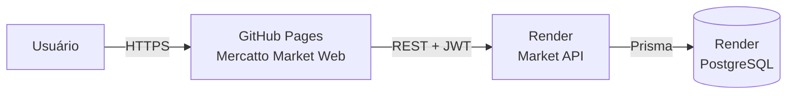

# Mercatto Market Web

Frontend publicado do Mercatto, um painel de gestão para pequenos mercados. O
site consome a Market API hospedada no Render e oferece uma interface para
produtos, categorias, estoque, caixa e vendas.

## Sistema publicado

| Recurso            | Endereço                                               |
| ------------------ | ------------------------------------------------------ |
| Site               | <https://saneromachado.github.io/mercatto-market-web/> |
| Saúde da API       | <https://market-api-njmw.onrender.com/api/health>      |
| Swagger            | <https://market-api-njmw.onrender.com/docs>            |
| Código do frontend | <https://github.com/saneromachado/mercatto-market-web> |
| Código da API      | <https://github.com/saneromachado/market-api>          |

A base REST usada pelo site é:

```text
https://market-api-njmw.onrender.com/api
```

## Arquitetura



- O GitHub Pages hospeda os arquivos estáticos do frontend.
- O Render executa a API NestJS.
- O PostgreSQL do Render armazena os dados do sistema.
- O navegador envia o JWT nas operações autenticadas.
- A API autoriza a origem `https://saneromachado.github.io` pelo CORS.

## Funcionalidades disponíveis

- login com JWT;
- visão geral da operação;
- catálogo de produtos;
- cadastro de categorias;
- entradas, saídas e ajustes de estoque;
- alertas de estoque baixo;
- frente de caixa;
- pagamento em dinheiro, cartão de crédito, cartão de débito e Pix;
- histórico de vendas;
- cancelamento de vendas com retorno ao estoque;
- configuração do endereço da API pela interface.

## Acesso

Abra o site e use:

```text
E-mail: admin@market.local
Senha: valor definido em ADMIN_PASSWORD no Render
```

A senha de produção não fica salva no frontend nem no GitHub.

## Publicação no GitHub Pages

O arquivo
[`deploy-pages.yml`](.github/workflows/deploy-pages.yml) publica o frontend
automaticamente após cada push na branch `main`.

O workflow:

1. instala as dependências;
2. executa a verificação de tipos;
3. executa o lint;
4. gera a exportação estática;
5. envia o diretório `out/` ao GitHub Pages;
6. publica o site.

O repositório usa **Settings > Pages > Source: GitHub Actions**.

## Configuração de produção

O workflow define:

```env
GITHUB_PAGES=true
NEXT_PUBLIC_API_URL=https://market-api-njmw.onrender.com/api
```

Quando `GITHUB_PAGES=true`, o arquivo
[`next.config.ts`](next.config.ts) configura:

- exportação estática;
- caminho base `/mercatto-market-web`;
- URLs de recursos compatíveis com o GitHub Pages.

Nenhuma senha ou segredo deve ser colocado em variáveis `NEXT_PUBLIC_`, pois
esses valores fazem parte do JavaScript entregue ao navegador.

## Atualização do site

Para acompanhar uma publicação:

1. abra a aba **Actions** do repositório;
2. selecione **Publicar frontend no GitHub Pages**;
3. aguarde os jobs `build` e `deploy` terminarem com sucesso;
4. abra o site com `Ctrl + F5` para descartar arquivos antigos em cache.

O workflow também pode ser iniciado manualmente com **Run workflow**.

## Problemas comuns em produção

### `Failed to fetch`

O navegador não conseguiu chamar a API. Verifique:

1. se <https://market-api-njmw.onrender.com/api/health> responde;
2. se o último deploy do Render está como **Deployed**;
3. se a API autoriza `https://saneromachado.github.io` no CORS;
4. se a URL configurada na tela termina em `/api`.

### A página demora para entrar

O frontend é estático e carrega pelo GitHub Pages, mas a API gratuita do Render
pode precisar despertar após um período sem uso.

### Login retorna `401`

O frontend conseguiu acessar a API, mas as credenciais foram rejeitadas.
Confirme `admin@market.local` e a senha definida em `ADMIN_PASSWORD` no Render.

### GitHub Pages retorna `404`

Confirme:

- que o último workflow terminou com sucesso;
- que o Pages usa **GitHub Actions** como fonte;
- que a URL termina em `/mercatto-market-web/`;
- que o caminho base em `next.config.ts` é `/mercatto-market-web`.

## Documentação completa

Consulte a
[documentação de integração](https://github.com/saneromachado/market-api/blob/main/docs/INTEGRACAO.md)
para detalhes sobre frontend, API, banco, JWT, CORS, deploys e diagnóstico.
